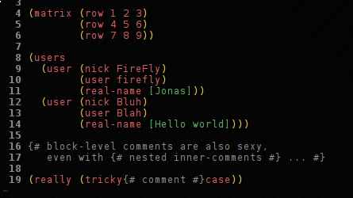

Syntax files for vim describing the Self-ML markup language.

## Installation

Place `selfml.vim` in your *.vim/syntax* directory.  That's it; you can now open
fiels and do `set ft=selfml`, or use `ft=selfml` in the modeline inside a file.

Should you want vim to automagically use this syntax file for files ending with
`.selfml`, you could add the following to your `.vimrc`:

    au BufRead,BufNewFile {*.selfml} set ft=selfml

## Screenshot

Of course, the actual look & choice of colours depends on your vim
configuration.

